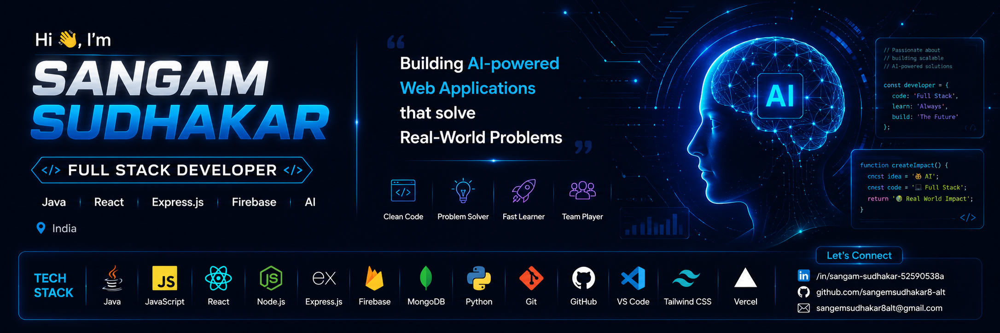

  

  

<h1 align="center">Hi 👋, I'm Sangam Sudhakar</h1>

<h3 align="center">
🚀 Full Stack Developer | Java | React | Express.js | Firebase | AI Enthusiast
</h3>

Passionate about building scalable web applications and AI-powered solutions that solve real-world challenges.

---

# 🚀 About Me

I'm a **B.Tech Computer Science student** passionate about building scalable full-stack applications and AI-powered solutions that solve real-world problems. I enjoy turning ideas into impactful software by combining modern web technologies with practical user-focused design.

- 🎓 B.Tech Computer Science Student
- 💻 Full Stack Developer (React • Express.js • Firebase • Node.js)
- 🤖 Passionate about AI-powered Web Applications
- 🌱 Currently exploring MERN Stack, System Design & Cloud Technologies
- 🔍 Interested in Software Engineering, Full-Stack Development & AI
- 🚀 Building projects focused on accessibility, automation, and real-world impact
- 📍 Based in India
- 🎯 Aspiring Software Engineer

---

# 🌐 Let's Connect

---

# 🛠 Tech Stack

---

# 🚀 Featured Projects

## 👷 Smart Wage Worker

AI-powered workforce management platform that empowers daily-wage workers and employers through AI, voice assistance, GPS tracking, and trust-based workforce management.

### Tech Stack

React • Express.js • Firebase • Firestore • AI

### Key Features

- 🎤 Voice Assistant
- 📍 GPS Attendance
- 🛰️ Geo-Fencing
- 📱 QR Worker ID
- 📊 Analytics Dashboard
- ⭐ Trust Score System

---

## 🍽 Recipe Finder Agent

AI-powered recipe discovery agent built using Google ADK with MCP integration and human approval workflows.

### Tech Stack

Python • Google ADK • Gemini • FastAPI • MCP

### Key Features

- 🤖 AI Recipe Generation
- 🥗 Ingredient Cleaning
- 👤 Human Approval Workflow
- 🔌 MCP Integration
- 🔒 Security Layer

---

# 📊 Contribution Graph

---

<i>"Building AI-powered applications that solve real-world challenges."</i>

---

# 👀 Profile Visitors

---

<h3 align="center">
⭐ Thanks for visiting my profile! ⭐
</h3>

Happy Coding 🚀

